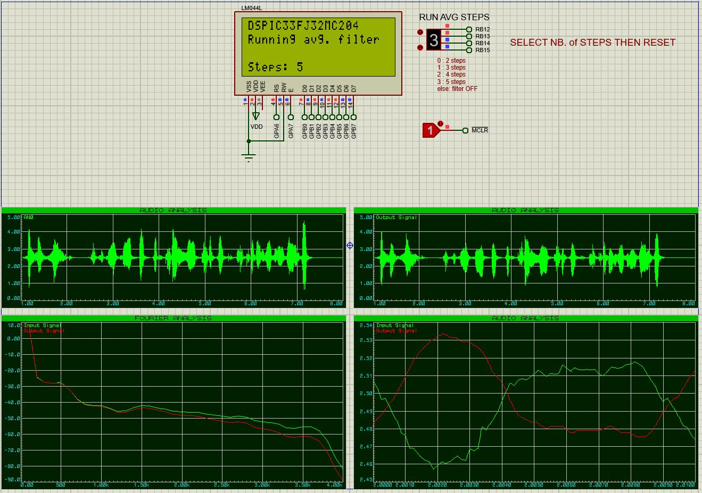

# Audio Signal Processing (DSP)
Audio signal filtering using DSPIC33FJ32MC204 in C

This school project allows to process an input analog signal applying a running average filter.

## Components 
* Microcontroller DSPIC33FJ32MC204
* Digital-to-Analog Converter DAC1208
* LCD 20x4 LM044L
* I/O Expander 16 bits MCP23S17

## Environment
* MPLABX v5.40
* Proteus 8

### Example

